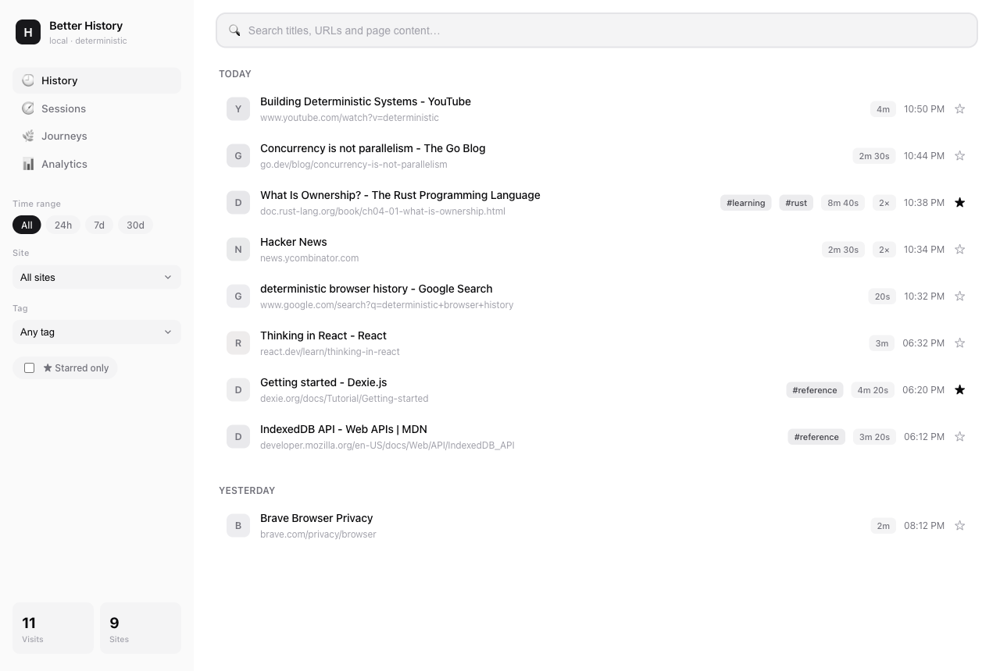

# A Better Browser History

[](https://github.com/arhxam/better-browser-history/actions/workflows/ci.yml)
[](LICENSE)

A local-first, **deterministic** history layer for Chromium browsers (Chrome, Brave, Edge).

[Product site](https://arhxam.github.io/better-browser-history/) ·
[Privacy policy](https://arhxam.github.io/better-browser-history/privacy.html) ·
[Support](https://arhxam.github.io/better-browser-history/support.html) ·
[Releases](https://github.com/arhxam/better-browser-history/releases)

Brave (and any browser set to clear history on exit) can leave you with no usable
history at all. This extension keeps its **own** history in local IndexedDB — captured
independently of the browser's native store — and builds a richer understanding on top
of it: full‑text search of page *content*, real time‑on‑page, sessions, navigation
journeys, dedup with visit counts, tags/notes/stars, and an analytics dashboard.

Everything stays on your device. Nothing is ever sent anywhere.



## Features

- **Full‑text content search** — searches the actual visible text of every page you
  visited, not just titles and URLs. Deterministically ranked (TF‑IDF).
- **Real engagement** — active foreground time per page (idle/blur excluded) and scroll depth.
- **Sessions** — visits grouped into browsing sessions by a 30‑minute inactivity gap.
- **Journeys** — navigation trees reconstructed from referrer links and tab‑opener relationships.
- **Smart dedup** — repeat visits to the same URL collapse into one entry with a visit count.
- **Active-time analytics** — precise foreground/non-idle time shares by site and category,
  measurement coverage, daily trends, a weekday/hour heatmap, top engaged pages, and session behavior.
- **Visit analytics** — top sites, visits-by-hour, per-day trends, and deterministic categories.
- **Tags, notes & stars** — annotate and filter your history.
- **Native History integration** — `brave://history` / `chrome://history` opens the full dashboard; New Tab remains untouched.
- **Three surfaces** — the browser **History page**, a full-page **dashboard**, and a toolbar **popup**.
- **Expanded settings** — capture controls, excluded sites, display defaults, retention, JSON backup/import, and clear-all.

Every derived signal is computed by pure, deterministic rules — no machine learning,
no network calls, no randomness. The same visits always produce the same views.

## Install (load unpacked)

Until the Chrome Web Store listing is approved, install the reviewed release package
locally or load the production build unpacked.

1. Build it:
   ```bash
   npm install
   npm run build
   ```
   This produces a `dist/` folder — the unpacked extension.
2. Open your browser's extensions page:
   - Chrome / Brave / Edge: go to **`chrome://extensions`** (Brave: `brave://extensions`).
3. Turn on **Developer mode** (top‑right toggle).
4. Click **Load unpacked** and select the `dist/` folder.
5. Review the privacy disclosure and explicitly enable private history if you want capture.
   Open the toolbar icon for the popup, or
   visit **`brave://history`** / **`chrome://history`** for the full dashboard. Your normal
   New Tab page is not changed.

> After changing code, re‑run `npm run build` and click the reload icon on the extension card.

### Replacing an older unpacked copy

An unpacked extension stays tied to the folder that was selected when it was loaded.
Refreshing a tab does **not** reload manifest changes. Before replacing an older copy,
open the extension's Settings page and **Export JSON** so its local IndexedDB history
can be restored if the extension ID changes.

1. Run `npm run build && npm run doctor` in the permanent repository. The doctor prints
   the exact absolute `dist/` folder to select and verifies that New Tab/homepage takeover
   fields are absent.
2. Open `brave://extensions`, remove the older Better Browser History copy, then click
   **Load unpacked** and select the folder printed by the doctor.
3. Confirm the extension details show the expected version and permanent **Loaded from**
   path. The permissions list must not say “Replace the page you see when opening a new tab.”
4. If the extension ID changed, open Settings and **Import JSON** using the backup from step 1.

Always load the permanent repository's `dist/` folder. Do not load a temporary worktree or
Conductor workspace because that directory can move or be removed.

## Permissions (and why)

The manifest uses an exact least-privilege permission allowlist:

| Permission | Why |
|---|---|
| `<all_urls>` host access + `content_scripts` | capture page content and engagement on every site |
| `webNavigation` | record top-level navigations; matching host access lets the extension resolve tab-opener journeys without the broader `tabs` permission |
| `unlimitedStorage` | keep the local IndexedDB history from being evicted under normal quota pressure |
| `idle` | exclude away‑from‑keyboard time from dwell |
| `alarms` | periodic retention pruning (off by default) |
| `contextMenus` | open the dashboard from the extension action context menu |

The extension does not request the browser `tabs`, `history`, `storage`, `scripting`, or
`favicon` permissions. It does not replace New Tab, homepage, search, startup pages, or bookmarks.

## Privacy

Capture is off until the user accepts the in-product disclosure. Once enabled, all data
lives in the extension's local IndexedDB. There are no analytics, no telemetry, and no
outbound requests for history data. You can pause, clear, exclude sites, or export data
from Settings. Read the full [privacy policy](https://arhxam.github.io/better-browser-history/privacy.html).

## Development

```bash
npm install
npm run dev          # Vite dev server — preview the UI in a normal tab:
                     #   http://localhost:5173/src/ui/dashboard.html?demo=1
                     #   http://localhost:5173/src/ui/popup.html?demo=1
                     #   http://localhost:5173/src/ui/history.html?demo=1
                     #   http://localhost:5173/src/ui/options.html?demo=1
npm run build        # produce dist/ (the unpacked extension)
npm test             # run the deterministic core + pipeline test suite (Vitest)
npm run typecheck    # tsc --noEmit
npm run validate     # validate dist/manifest.json
npm run doctor       # print the exact unpacked folder and assert no New Tab/homepage takeover
npm run determinism  # assert src/core has no nondeterminism/network
```

The `?demo=1` mode seeds sample data into IndexedDB so the UI renders without loading the
extension — useful for local preview and screenshots.

## Architecture

```
src/
  core/        pure, deterministic logic (no chrome, no network, no randomness)
               tokenizer · fts · sessionizer · engagement · dedup · journeys · analytics
  db/          Dexie/IndexedDB schema + repository + demo seed
  background/  capture pipeline (chrome-free, unit-tested) + MV3 service worker
  content/     content script: page-text extraction + engagement tracking
  settings/    typed local capture, privacy, display, and retention preferences
  ui/          React history override / dashboard / popup / settings surfaces
scripts/       build (Vite UI + esbuild worker/content) · manifest · validators
test/          Vitest suites (core units + headless capture pipeline via fake-indexeddb)
```

`visits` is the single source of truth; sessions, journeys, dedup and analytics are all
derived on demand by the deterministic core.

## License

MIT
